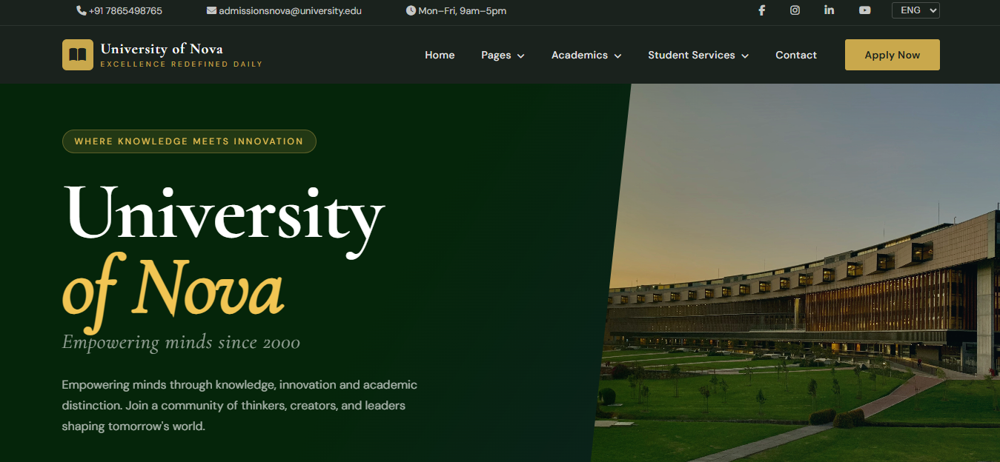
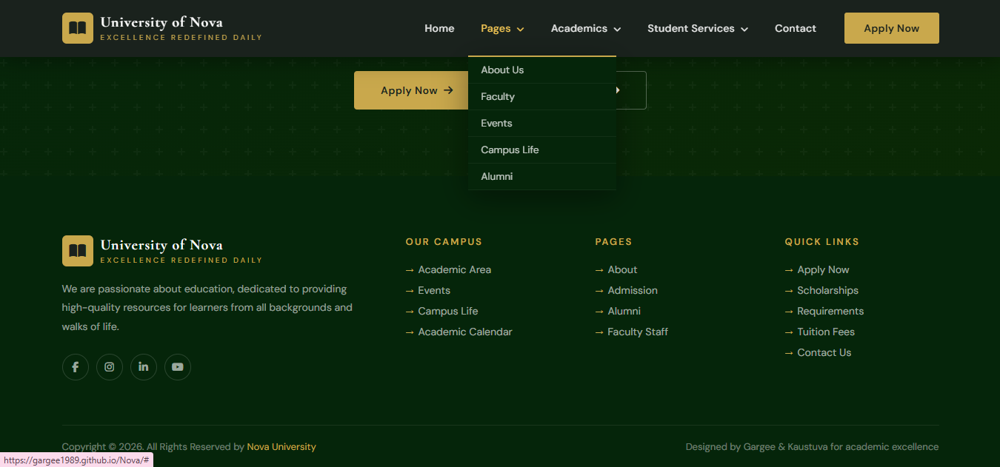
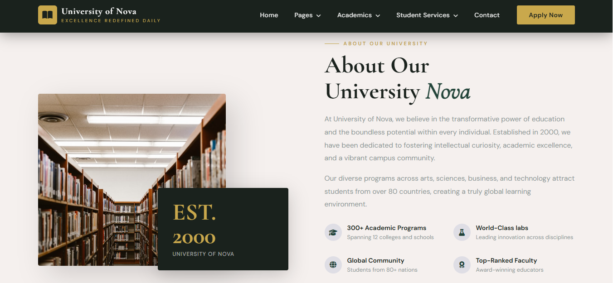
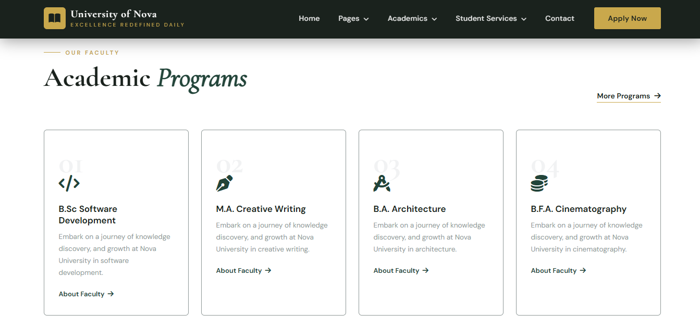
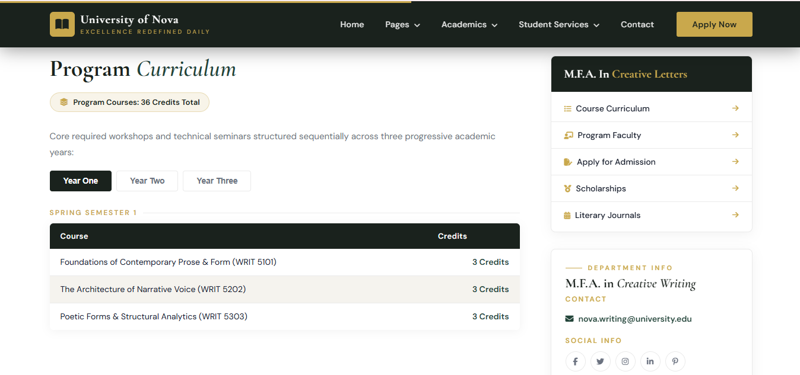
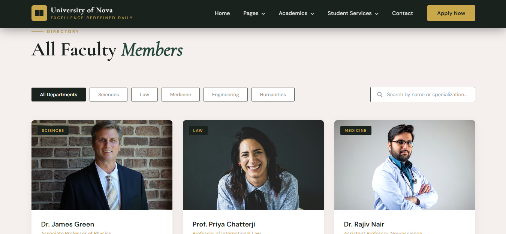
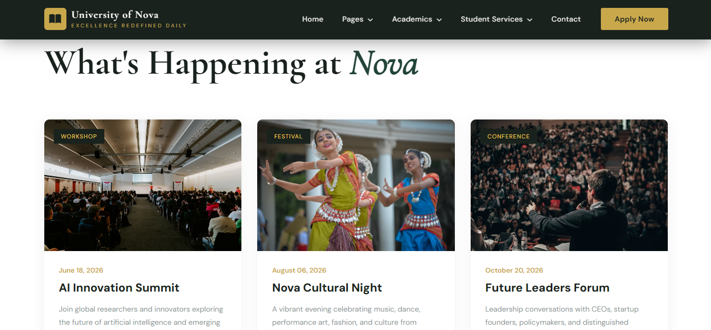
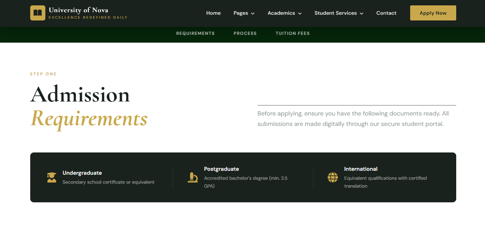
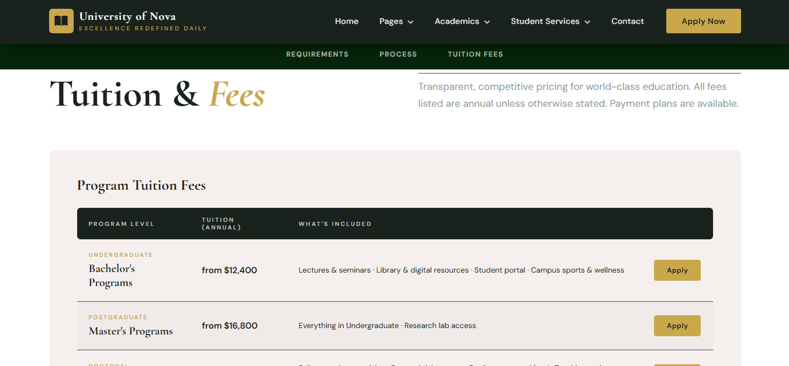
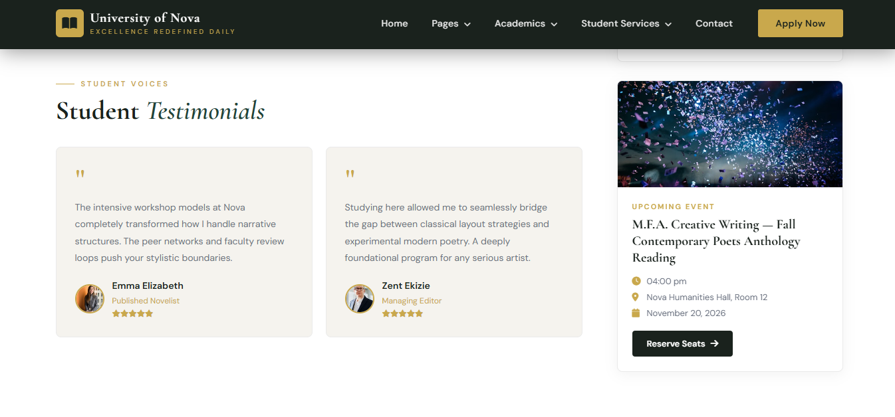

# University of Nova

**A GUI-Centric Mock University Website** <br>
**Authors:** Gargee Kakaty · Kaustuva Kashyap

---

## Table of Contents

- [Introduction](#introduction)
- [Objectives](#objectives)
- [Features](#features)
- [Tech Stack](#tech-stack)
- [Methodology](#methodology)
- [File Organization](#file-organization)
- [Pages Overview](#pages-overview)
- [Screenshots](#screenshots)
- [Getting Started](#getting-started)
- [Authors](#authors)

---

## Introduction

**Nova** is a GUI-centric mock university website built using core web technologies — HTML5, CSS3, and vanilla JavaScript. The project simulates a real-world university portal with a strong emphasis on **layout structure**, **visual hierarchy**, **design consistency**, and **intuitive navigation**.

Rather than prioritizing backend functionality, Nova concentrates on how users *perceive*, *navigate*, and *interact* with a digital academic environment. The GUI acts as the primary medium through which information — courses, admissions, institutional details, campus life, alumni, and faculty — is communicated with clarity, accessibility, and aesthetic balance.

Nova serves as a practical sandbox for experimenting with UI/UX design and browser-based logic, all without external frameworks.

---

## Objectives


4. Strengthen frontend development skills using core web technologies.
5. Present academic, cultural, historical, and institutional information in a coherent and intuitive manner.
6. Simulate how a university communicates its mission, departments, campus life, alumni, and student community through digital media.

---

## Features

- **Multi-page architecture** — 15+ interconnected pages spanning academics, admissions, campus life, and more
- **Responsive design** — Consistent experience across desktop and mobile screen sizes
- **Dynamic navigation** — Dropdown menus, hamburger toggle for mobile, and smooth in-page anchoring
- **Apply Now flow** — Dedicated application page
- **Animated statistics counter** — Live-counting enrollment figures on the homepage
- **Marquee announcement bar** — Scrolling highlights reel

---

## Tech Stack

| Technology | Role |
|---|---|
| **HTML** | Semantic structure — headers, navbars, cards, forms, sections |
| **CSS** | Styling via Flexbox & Grid; animations, hover states, responsive layouts |
| **JavaScript** | Interactivity — menu toggling, counters, form validation, dynamic rendering |

No external frameworks or libraries were used. Everything is written in pure, native web technology.

---

## Methodology

Development followed a **GUI-first approach**, where interface design decisions guided implementation.

### 1. GUI Design Phase
- Identification of primary user flows: browsing programs, checking admissions, contacting the university
- Creation of layout wireframes with a focus on visual hierarchy
- Selection of color schemes and typography appropriate for educational platforms

### 2. Implementation Phase
- **HTML5** — Semantic, accessible markup for all GUI components
- **CSS3** — Responsive layouts using Flexbox and Grid; custom animations and transitions
- **JavaScript** — Client-side logic for:
  - Navigation menu toggling
  - Interactive buttons and hover states
  - Form validation feedback
  - Dynamic content rendering (animated counters, carousels)

---

## File Organization

```
Nova/
│
├── index.html                        # Homepage
│
├── css/
│   ├── style.css                     # Global styles
│   ├── about.css
│   ├── academic-areas.css
│   ├── admission.css
│   ├── alumni.css
│   ├── applynow.css
│   ├── calendar.css
│   ├── campus.css
│   ├── contact.css
│   ├── events.css
│   ├── faculty.css
│   ├── programs.css
│   └── scholarship.css
│
├── js/
│   ├── script.js                     # Global scripts
│   ├── about.js
│   ├── admission.js
│   ├── alumni.js
│   ├── applynow.js
│   ├── calendar.js
│   ├── campus.js
│   ├── contact.js
│   ├── events.js
│   ├── faculty.js
│   ├── programs.js
│   └── scholarship.js
│
├── images/                           # Local image assets
│   └── campus.jpg
│
└── html/
    ├── admission.html
    │
    ├── pages/
    │   ├── about.html
    │   ├── faculty.html
    │   ├── events.html
    │   ├── campus.html
    │   └── alumni.html
    │
    ├── academic/
    │   ├── academic-areas.html
    │   └── calendar.html
    │
    ├── programs/
    │   ├── allprog.html
    │   ├── sd.html                   # B.Sc Software Development
    │   ├── cw.html                   # M.A. Creative Writing
    │   ├── arch.html                 # B.A. Architecture Design
    │   └── cine.html                 # B.F.A. Cinematography
    │
    ├── studentservices/
    │   └── scholarship.html
    │
    ├── Contact.html
    └── applynow.html
```

---

## Pages Overview

| Page | Path | Description |
|---|---|---|
| Home | `index.html` | Landing page with hero, stats, programs, campus life, faculty, testimonials, and events |
| About | `html/pages/about.html` | University history, mission, and values |
| Faculty | `html/pages/faculty.html` | Faculty listings and profiles |
| Events | `html/pages/events.html` | Upcoming university events |
| Campus Life | `html/pages/campus.html` | Student life, arts, culture, and athletics |
| Alumni | `html/pages/alumni.html` | Alumni network and stories |
| Academic Areas | `html/academic/academic-areas.html` | Overview of colleges and departments |
| Academic Calendar | `html/academic/calendar.html` | Semester schedule and key dates |
| Admission | `html/admission.html` | Requirements, process, and tuition fees |
| All Programs | `html/programs/allprog.html` | Full list of academic programs |
| Software Development | `html/programs/sd.html` | B.Sc Software Development detail page |
| Creative Writing | `html/programs/cw.html` | M.A. Creative Writing detail page |
| Architecture | `html/programs/arch.html` | B.A. Architecture Design detail page |
| Cinematography | `html/programs/cine.html` | B.F.A. Cinematography detail page |
| Scholarships | `html/studentservices/scholarship.html` | Financial aid and scholarship information |
| Contact | `html/Contact.html` | Contact form and university details |
| Apply Now | `html/applynow.html` | Student application page |

---
## Screenshots











---
## Getting Started

No build tools or dependencies required. Simply clone the repository and open `index.html` in any modern browser.

```bash
git clone https://github.com/gargee1989/Nova.git
cd Nova
# Open index.html in your browser
```

Or visit the live deployment directly:
🔗 [https://gargee1989.github.io/Nova/](https://gargee1989.github.io/Nova/)

---

## Authors

| Name | Contributions |
|---|---|
| **Gargee Kakaty** | JavaScript integration, mobile compatibility, frontend implementation |
| **Kaustuva Kashyap** | UI/UX design, frontend implementation, documentation |

---

*Copyright © 2026. University of Nova. Designed by Gargee & Kaustuva for academic excellence.*
